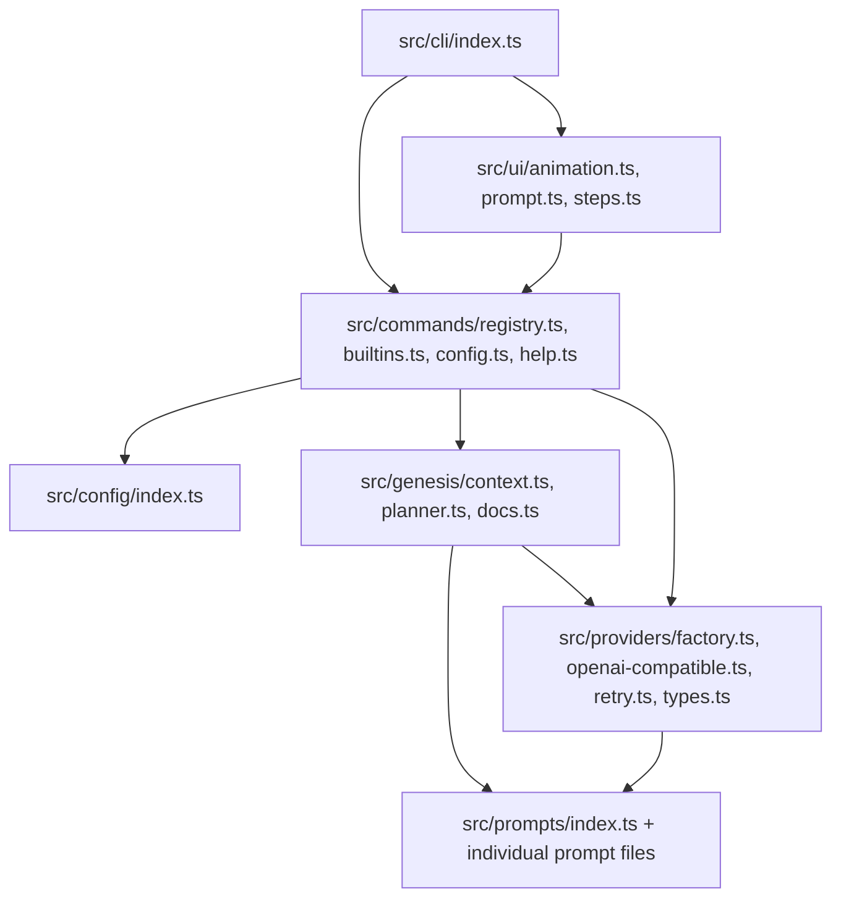
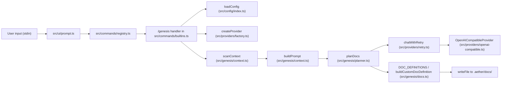
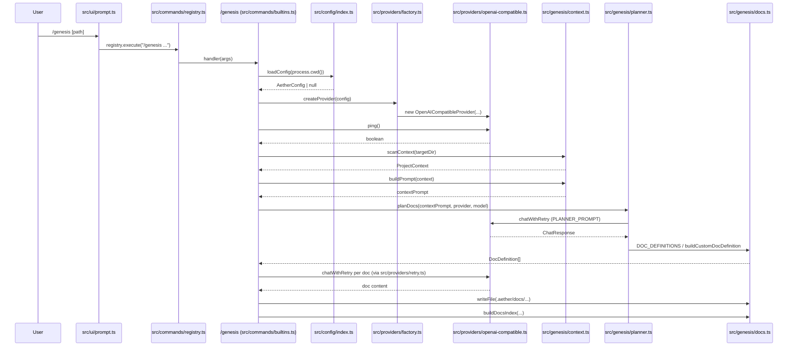

# System Diagrams — aether

Diagrams below use only modules/files verifiable in the provided project context (`src/cli/index.ts`, `src/commands/*`, `src/config/index.ts`, `src/genesis/*`, `src/providers/*`, `src/prompts/*`, `src/ui/*`).

## Component Diagram

## Data Flow Diagram

## Sequence Diagram — `/genesis` flow

