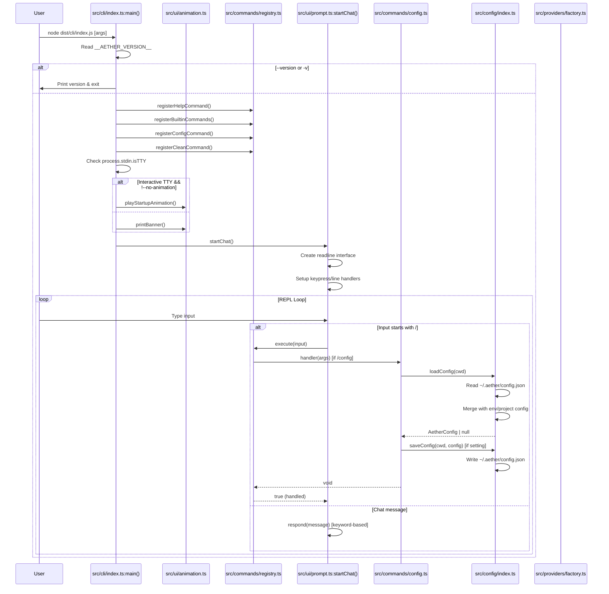
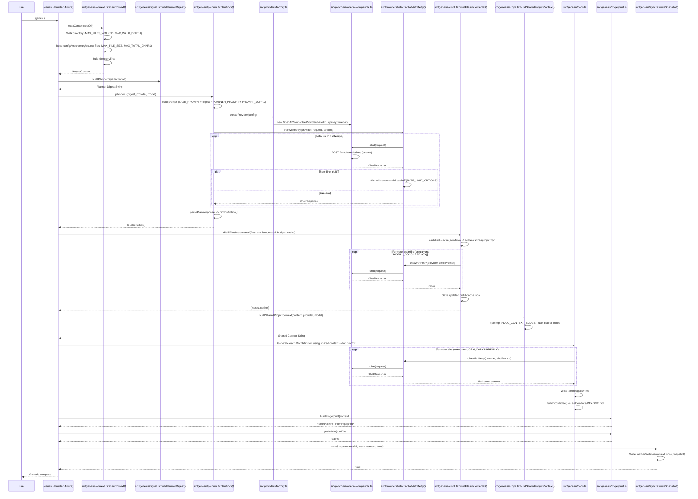
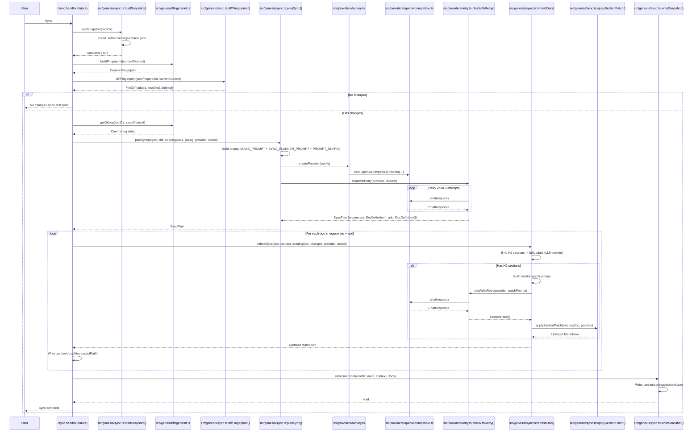
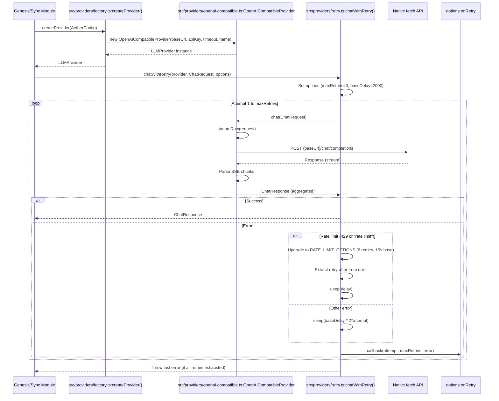

# System Diagrams

Based on the provided codebase, here are the three system diagrams using Mermaid syntax.

---

## 1. Component Diagram

```mermaid
graph TB
    %% CLI Entry Point
    CLI[src/cli/index.ts<br/>main()]

    %% Command System
    Registry[src/commands/registry.ts<br/>CommandRegistry]
    HelpCmd[src/commands/help.ts<br/>registerHelpCommand]
    BuiltinsCmd[src/commands/builtins.ts<br/>registerBuiltinCommands]
    ConfigCmd[src/commands/config.ts<br/>registerConfigCommand]
    CleanCmd[src/commands/clean.ts<br/>registerCleanCommand]

    %% Config Module
    ConfigMod[src/config/index.ts<br/>loadConfig/saveConfig/validateConfig]
    ConfigTypes[src/config/types.ts<br/>AetherConfig]
    ConfigReadme[src/config/readme.ts<br/>AETHER_README]
    ConfigScaffold[src/config/scaffold.ts<br/>ensureProjectReadme]

    %% Genesis Pipeline
    GenConstants[src/genesis/constants.ts<br/>Constants]
    GenContext[src/genesis/context.ts<br/>scanContext/buildPrompt]
    GenDigest[src/genesis/digest.ts<br/>buildPlannerDigest]
    GenDistill[src/genesis/distill.ts<br/>distillFilesIncremental]
    GenFingerprint[src/genesis/fingerprint.ts<br/>buildFingerprint/getGitInfo]
    GenScope[src/genesis/scope.ts<br/>buildSharedProjectContext]
    GenPlanner[src/genesis/planner.ts<br/>planDocs/parsePlan]
    GenSync[src/genesis/sync.ts<br/>planSync/refreshDoc/writeSnapshot]
    GenDocs[src/genesis/docs.ts<br/>DOC_DEFINITIONS/buildDocsIndex]
    GenTypes[src/genesis/types.ts<br/>Type Definitions]

    %% Prompts
    PromptsBase[src/prompts/base.ts<br/>BASE_PROMPT/PROMPT_SUFFIX]
    PromptsIndex[src/prompts/index.ts<br/>Re-exports]
    PromptsDocs[src/prompts/docs/*.ts<br/>13 Doc Prompts]
    PromptsPipeline[src/prompts/pipeline/*.ts<br/>Planner/Sync Prompts]

    %% Providers
    ProvTypes[src/providers/types.ts<br/>LLMProvider Interface]
    ProvFactory[src/providers/factory.ts<br/>createProvider]
    ProvOpenAI[src/providers/openai-compatible.ts<br/>OpenAICompatibleProvider]
    ProvRetry[src/providers/retry.ts<br/>chatWithRetry]

    %% UI
    UIAnimation[src/ui/animation.ts<br/>playStartupAnimation/printBanner]
    UIPrompt[src/ui/prompt.ts<br/>startChat/REPL]
    UISteps[src/ui/steps.ts<br/>StepRunner/LineSpinner]
    UITheme[src/ui/theme.ts<br/>Theme Constants]

    %% Util
    UtilEnv[src/util/env.ts<br/>envInt]

    %% Config Files
    PkgJson[package.json]
    TsConfig[tsconfig.json]
    SeaConfig[sea-config.json]

    %% Relationships
    CLI --> Registry
    CLI --> UIAnimation
    CLI --> UIPrompt
    CLI --> HelpCmd
    CLI --> BuiltinsCmd
    CLI --> ConfigCmd
    CLI --> CleanCmd

    HelpCmd --> Registry
    BuiltinsCmd --> Registry
    ConfigCmd --> Registry
    CleanCmd --> Registry

    ConfigCmd --> ConfigMod
    ConfigMod --> ConfigTypes
    ConfigMod --> ConfigReadme
    ConfigMod --> ConfigScaffold
    ConfigScaffold --> ConfigReadme

    GenConstants --> GenContext
    GenConstants --> GenDistill
    GenConstants --> GenScope
    GenConstants --> GenPlanner
    GenConstants --> GenSync

    GenContext --> GenDigest
    GenContext --> GenScope
    GenContext --> GenFingerprint

    GenDigest --> GenPlanner
    GenPlanner --> PromptsIndex
    GenPlanner --> ProvFactory
    GenPlanner --> GenDocs

    GenDistill --> ProvFactory
    GenDistill --> ProvRetry
    GenDistill --> GenConstants

    GenScope --> GenDistill
    GenScope --> ConfigMod
    GenScope --> GenConstants

    GenSync --> GenFingerprint
    GenSync --> GenPlanner
    GenSync --> GenDocs
    GenSync --> ProvFactory
    GenSync --> ProvRetry
    GenSync --> PromptsIndex

    GenDocs --> PromptsDocs
    GenDocs --> PromptsPipeline

    ProvFactory --> ProvTypes
    ProvFactory --> ProvOpenAI
    ProvOpenAI --> ProvTypes
    ProvRetry --> ProvTypes
    ProvRetry --> UITheme

    UIPrompt --> Registry
    UIPrompt --> UITheme
    UISteps --> UITheme
    UIAnimation --> UITheme

    GenConstants --> UtilEnv
    GenDistill --> UtilEnv
    GenScope --> UtilEnv
    GenPlanner --> UtilEnv
    GenSync --> UtilEnv

    CLI --> PkgJson
    CLI --> TsConfig
    CLI --> SeaConfig
```

---

## 2. Data Flow Diagram

```mermaid
flowchart TD
    %% Input Sources
    UserInput[User Input\nCLI Args / REPL]
    ProjectFiles[Project Files\nSource/Config/Vision]
    EnvVars[Environment Variables\nAETHER_*, OPENAI_API_KEY, etc.]
    GlobalConfig[~/.aether/config.json]
    GitRepo[Git Repository\ncommits/branches/status]

    %% CLI Entry & Command Routing
    CLIEntry[src/cli/index.ts:main()]
    CmdRegistry[src/commands/registry.ts:CommandRegistry]
    ConfigCmd[src/commands/config.ts:/config handler]
    CleanCmd[src/commands/clean.ts:/clean handler]
    GenesisCmd[/genesis handler\n(not in commands/ yet)]
    SyncCmd[/sync handler\n(not in commands/ yet)]

    %% Config Flow
    ConfigLoad[src/config/index.ts:loadConfig]
    ConfigSave[src/config/index.ts:saveConfig]
    ConfigValidate[src/config/index.ts:validateConfig]
    ConfigDefaults[src/config/index.ts:DEFAULT_CONFIGS]

    %% Genesis Pipeline
    ScanContext[src/genesis/context.ts:scanContext]
    BuildPrompt[src/genesis/context.ts:buildPrompt]
    PlannerDigest[src/genesis/digest.ts:buildPlannerDigest]
    PlanDocs[src/genesis/planner.ts:planDocs]
    DistillFiles[src/genesis/distill.ts:distillFilesIncremental]
    DistillSingle[src/genesis/distill.ts:distillSingle]
    BuildSharedCtx[src/genesis/scope.ts:buildSharedProjectContext]
    GenDocs[src/genesis/docs.ts:DOC_DEFINITIONS]
    WriteDocs[Write .aether/docs/*.md]
    WriteIndex[src/genesis/docs.ts:buildDocsIndex]

    %% Sync Pipeline
    LoadSnapshot[src/genesis/sync.ts:loadSnapshot]
    DiffFingerprint[src/genesis/sync.ts:diffFingerprint]
    PlanSync[src/genesis/sync.ts:planSync]
    RefreshDoc[src/genesis/sync.ts:refreshDoc]
    ApplyPatch[src/genesis/sync.ts:applySectionPatch]
    WriteSnapshot[src/genesis/sync.ts:writeSnapshot]

    %% Fingerprinting & Git
    BuildFingerprint[src/genesis/fingerprint.ts:buildFingerprint]
    GetGitInfo[src/genesis/fingerprint.ts:getGitInfo]
    GetGitLog[src/genesis/fingerprint.ts:getGitLog]

    %% LLM Provider Flow
    ProviderFactory[src/providers/factory.ts:createProvider]
    OpenAIProvider[src/providers/openai-compatible.ts:OpenAICompatibleProvider]
    ChatRetry[src/providers/retry.ts:chatWithRetry]
    ChatStream[src/providers/openai-compatible.ts:chatStream]

    %% Prompts
    BasePrompt[src/prompts/base.ts:BASE_PROMPT]
    PlannerPrompt[src/prompts/pipeline/planner.ts:PLANNER_PROMPT]
    SyncPlannerPrompt[src/prompts/pipeline/sync.ts:SYNC_PLANNER_PROMPT]
    DocPrompts[src/prompts/docs/*.ts:13 Doc Prompts]

    %% UI
    StartupAnim[src/ui/animation.ts:playStartupAnimation]
    StartChat[src/ui/prompt.ts:startChat]
    StepRunner[src/ui/steps.ts:StepRunner]

    %% Data Flow Connections
    UserInput --> CLIEntry
    CLIEntry --> StartupAnim
    CLIEntry --> CmdRegistry
    CLIEntry --> StartChat

    StartChat --> CmdRegistry
    CmdRegistry --> ConfigCmd
    CmdRegistry --> CleanCmd
    CmdRegistry --> GenesisCmd
    CmdRegistry --> SyncCmd

    %% Config Flow
    ConfigCmd --> ConfigLoad
    ConfigLoad --> GlobalConfig
    ConfigLoad --> EnvVars
    ConfigLoad --> ConfigDefaults
    ConfigCmd --> ConfigValidate
    ConfigCmd --> ConfigSave
    ConfigSave --> GlobalConfig

    %% Genesis Flow
    GenesisCmd --> ScanContext
    ScanContext --> ProjectFiles
    ScanContext --> GitRepo
    ScanContext --> BuildPrompt
    BuildPrompt --> PlannerDigest
    PlannerDigest --> PlanDocs
    PlanDocs --> ProviderFactory
    PlanDocs --> PlannerPrompt
    PlanDocs --> BasePrompt
    PlanDocs --> GenDocs
    PlanDocs --> DistillFiles
    DistillFiles --> DistillSingle
    DistillSingle --> ChatRetry
    ChatRetry --> OpenAIProvider
    OpenAIProvider --> ChatStream
    BuildSharedCtx --> DistillFiles
    BuildSharedCtx --> GenDocs
    BuildSharedCtx --> WriteDocs
    WriteDocs --> WriteIndex

    %% Sync Flow
    SyncCmd --> LoadSnapshot
    LoadSnapshot --> GlobalConfig
    SyncCmd --> BuildFingerprint
    BuildFingerprint --> ProjectFiles
    BuildFingerprint --> DiffFingerprint
    DiffFingerprint --> PlanSync
    PlanSync --> ProviderFactory
    PlanSync --> SyncPlannerPrompt
    PlanSync --> BasePrompt
    PlanSync --> GetGitLog
    PlanSync --> RefreshDoc
    RefreshDoc --> ChatRetry
    RefreshDoc --> ApplyPatch
    RefreshDoc --> WriteSnapshot
    WriteSnapshot --> GlobalConfig

    %% Provider Config
    ProviderFactory --> ConfigLoad
    ProviderFactory --> OpenAIProvider
    ChatRetry --> OpenAIProvider
    ChatRetry --> UITheme[src/ui/theme.ts]

    %% Constants & Env
    GenConstants[src/genesis/constants.ts] --> ScanContext
    GenConstants --> DistillFiles
    GenConstants --> BuildSharedCtx
    GenConstants --> PlanDocs
    GenConstants --> PlanSync
    UtilEnv[src/util/env.ts:envInt] --> GenConstants
```

---

## 3. Sequence Diagrams

### 3.1 CLI Startup & Command Execution



### 3.2 Genesis Pipeline (Conceptual Flow from Genesis Modules)



### 3.3 Sync Pipeline (Conceptual Flow from Sync Module)



### 3.4 LLM Provider Call Flow



---

## Notes

- **Genesis & Sync commands** are defined in the genesis modules (`src/genesis/*.ts`) but **not yet registered** in `src/commands/builtins.ts` or `src/commands/registry.ts` — the CLI only registers `help`, `config`, and `clean` commands currently.
- **Provider support**: Only `OpenAICompatibleProvider` exists; the Anthropic case in `factory.ts` has a TODO comment noting it needs its own provider implementation.
- **UI/REPL**: The `startChat()` REPL in `src/ui/prompt.ts` handles `/` commands via the registry but has no AI connection yet — `respond()` only does keyword matching.
- **Constants** in `src/genesis/constants.ts` are all configurable via `AETHER_*` environment variables via `envInt()`.
- **Config storage**: Global config at `~/.aether/config.json` holds shared `default` + per-project entries; secrets never written to repo.