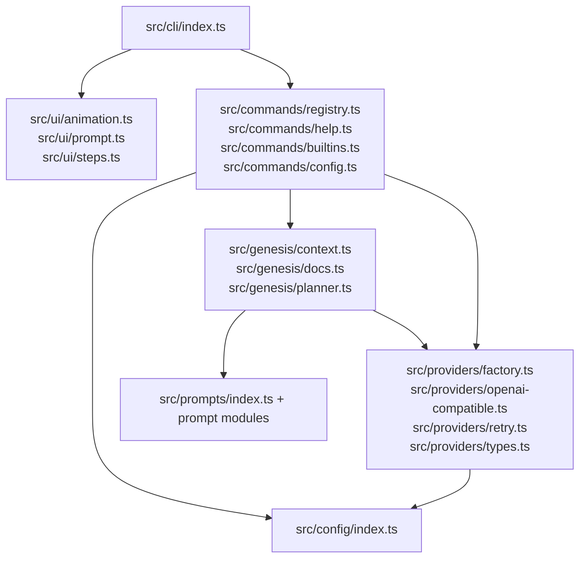
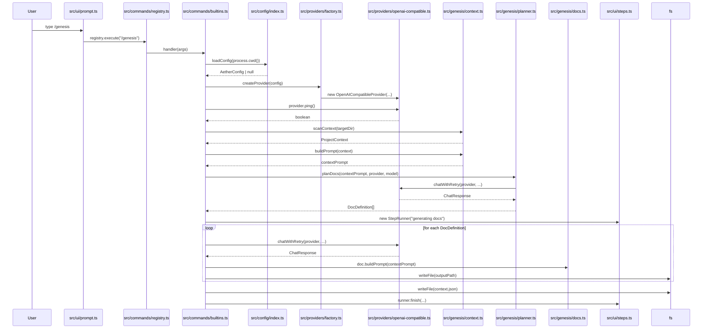

# System Diagrams

The following diagrams are derived strictly from the files and modules present in the provided `aether` project context.

## Component Diagram

## Data Flow Diagram

```mermaid
flowchart LR
    user["User (stdin)"] --> prompt["src/ui/prompt.ts"]
    prompt --> registry["src/commands/registry.ts"]
    registry --> builtins["src/commands/builtins.ts"]
    builtins --> context["src/genesis/context.ts"]
    context --> buildPrompt["buildPrompt()"]
    buildPrompt --> planner["src/genesis/planner.ts"]
    planner --> providers["src/providers/openai-compatible.ts"]
    providers --> docs["src/genesis/docs.ts"]
    docs --> fs[".aether/docs/ + context.json"]
```

## Sequence Diagram — `/genesis` command flow

