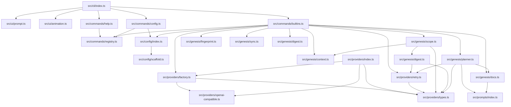
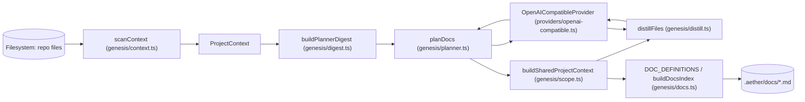
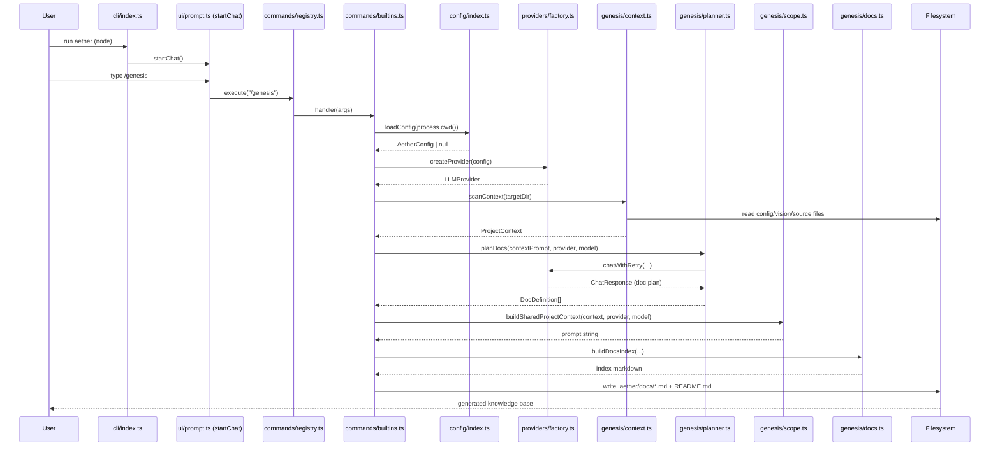

# System Diagrams

The following diagrams are derived strictly from the files and relationships present in the provided project context (aether v0.1.3).

## 1. Component Diagram

Shows the main modules/packages and their import relationships as verified in the distilled source facts.

## 2. Data Flow Diagram

Illustrates the flow of project data during the `/genesis` command as implemented in `src/commands/builtins.ts` and supporting genesis modules.

## 3. Sequence Diagram

Key flow: user invokes `/genesis` from the CLI chat, triggering analysis and documentation generation.

