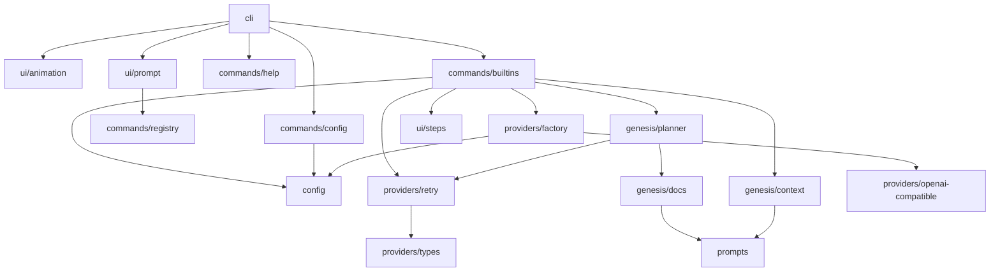

# Modules Overview

The following modules exist in the `src/` directory of the project as shown in the provided directory structure and source files.

## cli

**Purpose**
Entry point of the CLI application. Parses `--version`/`--no-animation` flags, registers commands, and starts the interactive chat or prints the banner.

**Key Files**
- `src/cli/index.ts` — Node entry script. Imports animation, prompt, and command registrars; defines `main()` which handles version flags, registers `help`/`builtins`/`config` commands, and conditionally plays startup animation or prints banner before calling `startChat()`.

**Exports**
- No explicit `export` statements; executed as the bin script (`#!/usr/bin/env node`). Declares `main()` and `VERSION` locally.

**Dependencies**
- `../ui/animation.js` (`playStartupAnimation`, `printBanner`)
- `../ui/prompt.js` (`startChat`)
- `../commands/help.js` (`registerHelpCommand`)
- `../commands/builtins.js` (`registerBuiltinCommands`)
- `../commands/config.js` (`registerConfigCommand`)

**Flow**
`main()` → check version args → register commands → check TTY/animation flag → `playStartupAnimation()` or `printBanner()` → `startChat()`.

## commands

**Purpose**
Implements the command system: registration, parsing, execution, and the built-in/help/config command handlers used by the CLI.

**Key Files**
- `src/commands/registry.ts` — Defines `Command` interface and `CommandRegistry` class with `register`, `get`, `getAll`, `has`, `execute`. Exports singleton `registry`.
- `src/commands/help.ts` — `registerHelpCommand()` registers `help` command that lists all commands from `registry`.
- `src/commands/builtins.ts` — `registerBuiltinCommands()` registers `genesis`, `sync`, `exit`, `clear`. `genesis` handler scans project, plans docs, generates them via provider; depends on `config`, `providers/factory`, `providers/retry`, `genesis/context`, `genesis/planner`, `ui/steps`.
- `src/commands/config.ts` — `registerConfigCommand()` registers `config` command for showing/setting AI provider config; depends on `../config/index.js`.

**Exports**
- `registry` (from `registry.ts`)
- `registerHelpCommand` (from `help.ts`)
- `registerBuiltinCommands` (from `builtins.ts`)
- `registerConfigCommand` (from `config.ts`)
- `Command` interface (from `registry.ts`)

**Dependencies**
- `chalk` (dependency in `package.json`)
- `../config/index.js`
- `../providers/factory.js`
- `../providers/retry.js`
- `../genesis/context.js`
- `../genesis/planner.js`
- `../ui/steps.js`
- `../ui/prompt.js` (imports `registry` and `Command` type)

**Flow**
Commands registered at startup → user input parsed by `registry.execute()` in `ui/prompt.ts` → matching handler invoked → handler uses config/providers/genesis modules.

## config

**Purpose**
Loads, saves, validates, and provides default AI provider configuration stored at `.aether/config.json`.

**Key Files**
- `src/config/index.ts` — Defines `AetherConfig` interface, `DEFAULT_CONFIGS` for openai/anthropic/gemini/openrouter, `getDefaultConfig`, `detectProviderFromBaseUrl`, `getConfigPath`, `loadConfig`, `saveConfig`, `validateConfig`.

**Exports**
- `AetherConfig` interface
- `getDefaultConfig`, `detectProviderFromBaseUrl`, `getConfigPath`, `loadConfig`, `saveConfig`, `validateConfig`

**Dependencies**
- Node built-ins: `node:fs/promises`, `node:fs`, `node:path`

**Flow**
`loadConfig(rootDir)` reads `.aether/config.json` → `saveConfig` writes it → `validateConfig` checks fields → `commands/config.ts` calls these.

## genesis

**Purpose**
Implements the `genesis` analysis pipeline: scanning project context, defining doc catalog, and planning which docs to generate via LLM.

**Key Files**
- `src/genesis/context.ts` — `scanContext()` walks dirs, reads config/vision/entry/source files, builds tree and prompt (`buildPrompt`). Exports `ProjectContext` interface.
- `src/genesis/docs.ts` — Defines `DocDefinition`, `CustomDocSpec`, `DOC_DEFINITIONS` array, `buildCustomDocDefinition`. Imports prompts from `../prompts/index.js`.
- `src/genesis/planner.ts` — `planDocs()` calls LLM via `chatWithRetry`, parses plan, returns `DocDefinition[]`. Imports `DOC_DEFINITIONS`, `buildCustomDocDefinition` from `./docs.js`, prompts, and `../providers/retry.js`.

**Exports**
- `scanContext`, `buildPrompt`, `ProjectContext` (from `context.ts`)
- `DOC_DEFINITIONS`, `buildCustomDocDefinition`, `DocDefinition`, `CustomDocSpec` (from `docs.ts`)
- `planDocs` (from `planner.ts`)

**Dependencies**
- `../prompts/index.js`
- `../providers/types.js` (`LLMProvider`)
- `../providers/retry.js`
- Node built-ins (`node:fs/promises`, `node:fs`, `node:path`)

**Flow**
`builtins.ts` genesis handler → `scanContext` → `buildPrompt` → `planDocs` (uses provider + `DOC_DEFINITIONS`) → returns docs to generate.

## prompts

**Purpose**
Stores all LLM prompt strings and a builder for custom docs, exported via a barrel file.

**Key Files**
- `src/prompts/index.ts` — Re-exports `BASE_PROMPT`, `PROMPT_SUFFIX`, and all specific prompts (`SYSTEM_OVERVIEW_PROMPT`, etc.) plus `buildCustomDocPrompt`.
- Individual files: `base.ts`, `system-overview.ts`, `folder-structure.ts`, `tech-stack.ts`, `coding-standards.ts`, `modules.ts`, `api.ts`, `business.ts`, `diagrams.ts`, `ai-context.ts`, `glossary.ts`, `planner.ts`, `custom-doc.ts`.

**Exports**
- All prompt constants and `buildCustomDocPrompt` (via `index.ts`)

**Dependencies**
- None (self-contained string exports)

**Flow**
Imported by `genesis/docs.ts` and `genesis/planner.ts` to build prompts sent to LLM.

## providers

**Purpose**
Abstraction over LLM providers: types, OpenAI-compatible implementation, factory, and retry wrapper.

**Key Files**
- `src/providers/types.ts` — Interfaces: `ChatMessage`, `ChatRequest`, `ChatResponse`, `StreamChunk`, `LLMProvider`.
- `src/providers/openai-compatible.ts` — `OpenAICompatibleProvider` class implementing `chat`, `chatStream`, `ping` via `fetch`.
- `src/providers/factory.ts` — `createProvider(config)` returns `OpenAICompatibleProvider` for openai/gemini/anthropic/openrouter.
- `src/providers/retry.ts` — `chatWithRetry()`, `createRetryLogger()` with exponential backoff.
- `src/providers/index.ts` — Barrel exporting types, class, `createProvider`.

**Exports**
- `LLMProvider`, `ChatMessage`, `ChatRequest`, `ChatResponse`, `StreamChunk` (types)
- `OpenAICompatibleProvider`
- `createProvider`
- `chatWithRetry`, `createRetryLogger`

**Dependencies**
- `chalk`
- `../config/index.js` (`AetherConfig`)

**Flow**
`commands/config.ts` → `loadConfig` → `builtins.ts` → `createProvider` → `OpenAICompatibleProvider` used in `planDocs`/`chatWithRetry`.

## ui

**Purpose**
Terminal UI: startup animation, interactive chat loop with dropdown, and step-runner for genesis progress.

**Key Files**
- `src/ui/animation.ts` — `playStartupAnimation()`, `printBanner()` using `chalk` and `setTimeout`.
- `src/ui/prompt.ts` — `startChat()` using `node:readline`, dropdown on `/`, `respond()` for non-command input. Imports `registry` from `commands/registry.js`.
- `src/ui/steps.ts` — `StepRunner` class with `addStep`, `runStep`, `setWriting`, `finish`, `error` for rendering progress.

**Exports**
- `playStartupAnimation`, `printBanner` (animation.ts)
- `startChat` (prompt.ts)
- `StepRunner`, `Step` interface (steps.ts)

**Dependencies**
- `chalk`
- `../commands/registry.js` (prompt.ts)
- `../commands/builtins.js` (uses `StepRunner`)

**Flow**
`cli/index.ts` → `playStartupAnimation`/`printBanner` → `startChat` → readline input → `registry.execute` or `respond`.

## Dependency Map

