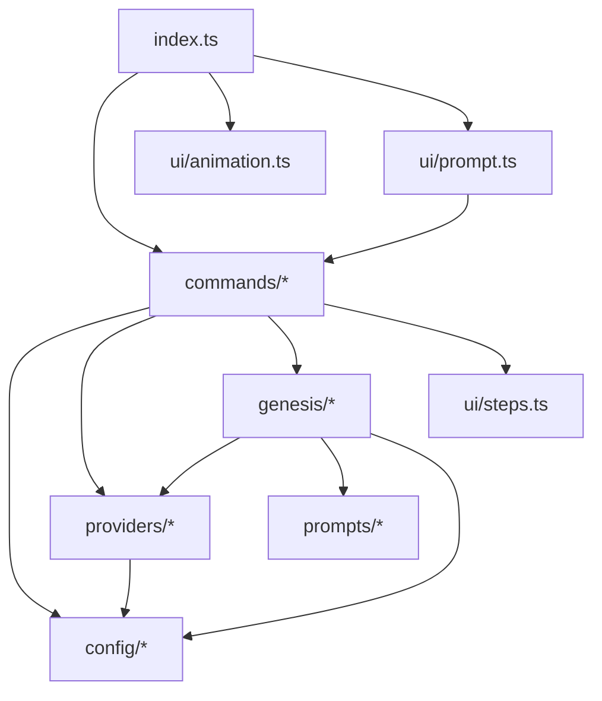

# Modules Overview

This document describes the major modules present in the `src/` directory of the `aether` project, based solely on the provided project context and distilled source facts.

## `src/cli`

### Purpose
Entry point for the CLI executable. Parses startup flags, registers commands, and starts the interactive chat loop.

### Key Files
- `index.ts` — CLI entry (`#!/usr/bin/env node`), calls `main()`; handles `--version`/`-v` and `--no-animation` flags; imports and calls `registerHelpCommand()`, `registerBuiltinCommands()`, `registerConfigCommand()`; uses `process.stdin.isTTY` to choose `playStartupAnimation()` vs `printBanner()`; calls `startChat()` from `../ui/prompt.js`.

### Exports
- (No explicit exports listed beyond the executable entry behavior.)

### Dependencies
- `../ui/animation.js`
- `../ui/prompt.js`
- `../commands/help.js`
- `../commands/builtins.js`
- `../commands/config.js`

### Flow
`main()` registers help/builtin/config commands → decides animation vs banner based on TTY → calls `startChat()` which reads user input and routes `/`-commands via the registry.

---

## `src/commands`

### Purpose
Implements CLI command registration and handlers (`/help`, `/config`, `/genesis`, `/sync`, `/exit`, `/clear`).

### Key Files
- `registry.ts` — Defines `Command` interface and `CommandRegistry` class (`register`, `get`, `getAll`, `has`, `execute`); exports `const registry`.
- `help.ts` — `registerHelpCommand()` lists all commands from `registry.getAll()`.
- `config.ts` — `registerConfigCommand()` handles `/config` provider/model/url/key setting and validation.
- `builtins.ts` — `registerBuiltinCommands()` registers `genesis`, `sync`, `exit`, `clear`; orchestrates scanning, planning, doc generation.

### Exports
- `registry` (from `registry.ts`)
- `registerHelpCommand` (from `help.ts`)
- `registerConfigCommand` (from `config.ts`)
- `registerBuiltinCommands` (from `builtins.ts`)

### Dependencies
- `./registry.js` (all command files)
- `../config/index.js` (`config.ts`, `builtins.ts`)
- `../providers/factory.js`, `../providers/retry.js` (`builtins.ts`)
- `../genesis/context.js`, `../genesis/digest.js`, `../genesis/planner.js`, `../genesis/scope.js`, `../genesis/docs.js`, `../genesis/fingerprint.js`, `../genesis/sync.js` (`builtins.ts`)
- `../ui/steps.js` (`builtins.ts`)
- `chalk` (all)

### Flow
User input → `registry.execute()` → matches `/command` → calls handler. `builtins.ts` handlers load config, create provider, scan context, plan docs, build context, generate and write docs.

---

## `src/config`

### Purpose
Manages Aether configuration loading/saving and `.aether` scaffold creation.

### Key Files
- `index.ts` — `AetherConfig` interface; `DEFAULT_CONFIGS`; `getDefaultConfig`; `detectProviderFromBaseUrl`; `loadConfig`/`saveConfig`; `validateConfig`; settings path helpers.
- `scaffold.ts` — `ensureAetherScaffold(rootDir)` writes `.gitignore` entry and `.aether/README.md`.

### Exports
- `interface AetherConfig`
- `DEFAULT_CONFIGS`, `getDefaultConfig`, `PROVIDER_HOSTS`, `detectProviderFromBaseUrl`, `getSettingsDir`, `getConfigPath`, `getLegacyConfigPath`, `loadConfig`, `saveConfig`, `validateConfig` (from `index.ts`)
- `ensureAetherScaffold` (from `scaffold.ts`)

### Dependencies
- `./scaffold.js` (from `index.ts`)
- `node:fs/promises`, `node:fs`, `node:path`

### Flow
`saveConfig` writes JSON and calls `ensureAetherScaffold` → creates `.aether/settings` and README. `loadConfig` reads from settings or legacy path.

---

## `src/genesis`

### Purpose
Core analysis and documentation generation: scans project, builds context, distills, plans docs, writes outputs.

### Key Files
- `context.ts` — `ProjectContext` interface; `scanContext()` walks files; `buildPrompt()`.
- `digest.ts` — `buildPlannerDigest()`; signal detection and symbol extraction.
- `fingerprint.ts` — `buildFingerprint()` (sha256); `getGitInfo()`, `getGitLog()`.
- `scope.ts` — `buildSharedProjectContext()` with budget/distill fallback.
- `distill.ts` — `distillFiles()` via LLM; `mapPool` concurrency; chunking.
- `planner.ts` — `planDocs()`; `parsePlan()`; `extractJsonArray()`.
- `docs.ts` — `DOC_DEFINITIONS`; `buildCustomDocDefinition`; `buildDocsIndex`.
- `sync.ts` — (referenced by `builtins.ts` for `diffFingerprint`, `hasChanges`, `loadSnapshot`, `planSync`, `mergeDocMetas`; not detailed in facts but file exists.)

### Exports
- `ProjectContext`, `scanContext`, `buildPrompt` (`context.ts`)
- `buildPlannerDigest` (`digest.ts`)
- `buildFingerprint`, `getGitInfo`, `getGitLog` (`fingerprint.ts`)
- `buildSharedProjectContext` (`scope.ts`)
- `distillFiles`, `DistillHooks`, `FileContent` (`distill.ts`)
- `planDocs`, `ParsedPlan`, `parsePlan`, `extractJsonArray` (`planner.ts`)
- `DOC_DEFINITIONS`, `DocDefinition`, `buildCustomDocDefinition`, `buildDocsIndex`, `DocSection`, `SECTION_ORDER` (`docs.ts`)

### Dependencies
- `../config/index.js` (`factory` usage in builtins)
- `../providers/types.js`, `../providers/factory.js`, `../providers/retry.js`
- `../prompts/index.js` (`docs.ts`, `planner.ts`)
- `../ui/steps.js` (`builtins.ts`)
- `node:fs`, `node:path`, `node:crypto`, `node:child_process`

### Flow
`scanContext` → `buildPrompt`/`buildPlannerDigest` → `planDocs` (LLM) → `buildSharedProjectContext` (distill if over budget) → `DOC_DEFINITIONS` prompts → `chatWithRetry` → write files + `buildDocsIndex`.

---

## `src/prompts`

### Purpose
Holds all prompt templates and builders used for LLM documentation generation.

### Key Files
- `base.ts` — `BASE_PROMPT`, `PROMPT_SUFFIX`, `HUMAN_BASE_PROMPT`, `HUMAN_PROMPT_SUFFIX`.
- `index.ts` — Re-exports all prompt constants and `buildCustomDocPrompt`.
- `planner.ts` — `PLANNER_PROMPT` (doc ID catalog).
- `custom-doc.ts` — `buildCustomDocPrompt(title, focus)`.
- Individual files: `ai-context.ts`, `api.ts`, `business.ts`, `coding-standards.ts`, `contributing.ts`, `diagrams.ts`, `folder-structure.ts`, `getting-started.ts`, `glossary.ts`, `modules.ts`, `onboarding.ts`, `sync.ts`, `system-overview.ts`, `tech-stack.ts` — each exports a prompt string.

### Exports
- All `*_PROMPT` constants and `buildCustomDocPrompt` (via `index.ts`)

### Dependencies
- None beyond internal files.

### Flow
`docs.ts` and `planner.ts` import prompts → embed in LLM messages.

---

## `src/providers`

### Purpose
Abstraction over LLM providers (OpenAI-compatible) with retry support.

### Key Files
- `types.ts` — `ChatMessage`, `ChatRequest`, `ChatResponse`, `StreamChunk`, `LLMProvider`.
- `openai-compatible.ts` — `OpenAICompatibleProvider` class (chat, chatStream, ping, SSE).
- `factory.ts` — `createProvider(config)` returns provider by name.
- `retry.ts` — `chatWithRetry`, `RetryOptions`, `createRetryLogger`.
- `index.ts` — Re-exports types, `OpenAICompatibleProvider`, `createProvider`.

### Exports
- `LLMProvider`, `ChatMessage`, `ChatRequest`, `ChatResponse`, `StreamChunk` (`types.ts`)
- `OpenAICompatibleProvider` (`openai-compatible.ts`)
- `createProvider` (`factory.ts`)
- `chatWithRetry`, `RetryOptions`, `formatRetryLine`, `createRetryLogger` (`retry.ts`)

### Dependencies
- `../config/index.js` (`factory.ts`)
- `chalk` (`retry.ts`)

### Flow
`createProvider(config)` → `OpenAICompatibleProvider` → `chatWithRetry` wraps `provider.chat` with backoff.

---

## `src/ui`

### Purpose
Terminal UI: startup animation, banners, interactive chat, step spinners.

### Key Files
- `animation.ts` — `playStartupAnimation()`, `printBanner()`.
- `prompt.ts` — `startChat()`; dropdown, completer, `respond()`.
- `steps.ts` — `StepRunner`, `LineSpinner`, `Step` interface.

### Exports
- `playStartupAnimation`, `printBanner` (`animation.ts`)
- `startChat` (`prompt.ts`)
- `StepRunner`, `LineSpinner`, `Step` (`steps.ts`)

### Dependencies
- `../commands/registry.js` (`prompt.ts`)
- `chalk` (all)

### Flow
CLI calls animation or banner → `startChat` loops readline → registry executes commands → `StepRunner`/`LineSpinner` show progress during genesis/sync.

---

## `scripts`

### Purpose
Build tooling for single-executable artifact (SEA).

### Key Files
- `build-sea.mjs` — Referenced by `package.json` `build:sea` script (`node scripts/build-sea.mjs`). No internal details provided.

### Exports
- Not detected from provided context.

### Dependencies
- Not detected from provided context.

### Flow
Not detected from provided context.

---

## Dependency Map

All edges above are verified by import statements listed in the distilled source facts (e.g., `builtins.ts` imports `../config/index.js`, `../providers/factory.js`, `../genesis/context.js`, `../ui/steps.js`).