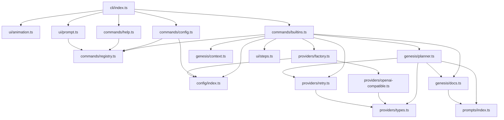

# Modules Overview

This document covers the modules present in the `aether` project source tree under `src/`, based solely on the provided directory structure and source files.

## cli

**Purpose** — Entry point of the Aether CLI. Registers commands and starts the interactive prompt or prints the banner.

**Key Files**
- `src/cli/index.ts` — Contains `main()`, which handles `--version`/`-v`, calls `registerHelpCommand()`, `registerBuiltinCommands()`, `registerConfigCommand()`, plays startup animation or prints banner based on TTY/flags, then calls `startChat()`.

**Exports** — No explicit exports; declares `main()` and invokes it. Declares `const VERSION` using `declare const __AETHER_VERSION__`.

**Dependencies**
- `../ui/animation.js` (`playStartupAnimation`, `printBanner`)
- `../ui/prompt.js` (`startChat`)
- `../commands/help.js` (`registerHelpCommand`)
- `../commands/builtins.js` (`registerBuiltinCommands`)
- `../commands/config.js` (`registerConfigCommand`)

**Flow** — Process starts → `main()` registers commands → checks args/TTY → animation or banner → `startChat()` begins readline loop.

## commands

**Purpose** — Implements CLI command registration and built-in commands (`genesis`, `sync`, `exit`, `clear`, `config`, `help`).

**Key Files**
- `src/commands/registry.ts` — Defines `Command` interface and `CommandRegistry` class with `register`, `get`, `getAll`, `has`, `execute` (case-insensitive name match, lowercase). Exports `registry` instance.
- `src/commands/builtins.ts` — Registers `genesis` (calls `scanContext`, `buildPrompt`, `planDocs`, `StepRunner`, writes `.aether/docs`), `sync` (stub), `exit`, `clear`. Exports `registerBuiltinCommands()`.
- `src/commands/config.ts` — Registers `config` command for provider setup. Exports `registerConfigCommand()`.
- `src/commands/help.ts` — Registers `help` command listing all commands. Exports `registerHelpCommand()`.

**Exports**
- `registry` (registry.ts)
- `registerBuiltinCommands` (builtins.ts)
- `registerConfigCommand` (config.ts)
- `registerHelpCommand` (help.ts)
- `Command` interface (registry.ts)

**Dependencies**
- `./registry.js` (all command files)
- `../config/index.js` (builtins, config)
- `../providers/factory.js`, `../providers/retry.js` (builtins)
- `../genesis/context.js`, `../genesis/planner.js`, `../genesis/docs.js` (builtins)
- `../ui/steps.js` (builtins)
- `../prompts/index.js` (docs via genesis)
- `node:fs/promises`, `node:fs`, `node:path` (builtins, config)
- `chalk` (all)

**Flow** — Commands registered into `registry` at startup → user input matched via `registry.execute()` → handler runs (e.g. `genesis` scans, plans, generates).

## config

**Purpose** — Defines and persists Aether configuration (provider, model, baseUrl, apiKey).

**Key Files**
- `src/config/index.ts` — Defines `AetherConfig` interface, `DEFAULT_CONFIGS` for openai/anthropic/gemini/openrouter, `getDefaultConfig()`, `detectProviderFromBaseUrl()`, `getConfigPath()`, `loadConfig()`, `saveConfig()`, `validateConfig()`.

**Exports** — `AetherConfig` (type), `getDefaultConfig`, `detectProviderFromBaseUrl`, `getConfigPath`, `loadConfig`, `saveConfig`, `validateConfig`.

**Dependencies**
- `node:fs/promises` (`readFile`, `writeFile`, `mkdir`)
- `node:fs` (`existsSync`)
- `node:path` (`join`)

**Flow** — Config read from `.aether/config.json` via `loadConfig` → modified via `saveConfig` → `detectProviderFromBaseUrl` re-syncs provider on URL change.

## genesis

**Purpose** — Scans target project, builds prompt context, plans docs via AI, and defines doc catalog.

**Key Files**
- `src/genesis/context.ts` — `scanContext()` reads config/vision/entry/source files within `MAX_TOTAL_CHARS` (300k), `buildPrompt()` assembles context string. Defines `ProjectContext` interface.
- `src/genesis/planner.ts` — `planDocs()` calls LLM with `PLANNER_PROMPT`, parses response, always includes `CORE_IDS`, builds custom docs. Exports `planDocs`.
- `src/genesis/docs.ts` — `DOC_DEFINITIONS` array, `buildCustomDocDefinition()`, `buildDocsIndex()`, `DocDefinition`/`CustomDocSpec` types, `SECTION_ORDER`.

**Exports**
- `scanContext`, `buildPrompt`, `ProjectContext` (context.ts)
- `planDocs` (planner.ts)
- `DOC_DEFINITIONS`, `buildCustomDocDefinition`, `buildDocsIndex`, `DocDefinition`, `CustomDocSpec`, `SECTION_ORDER`, `DocSection` (docs.ts)

**Dependencies**
- `node:fs/promises`, `node:fs`, `node:path` (context.ts)
- `../providers/types.js`, `../providers/retry.js` (planner.ts)
- `../prompts/index.js` (planner.ts, docs.ts)
- `./docs.js` (planner.ts)

**Flow** — `scanContext` → `buildPrompt` → `planDocs` (LLM) → returns `DocDefinition[]` → builtins writes files using `buildPrompt` per doc + `buildDocsIndex`.

## prompts

**Purpose** — Stores all LLM prompt strings and custom-doc builder used during generation.

**Key Files**
- `src/prompts/base.ts` — `BASE_PROMPT`, `PROMPT_SUFFIX` (anti-hallucination rules).
- `src/prompts/planner.ts` — `PLANNER_PROMPT` (JSON array schema).
- `src/prompts/custom-doc.ts` — `buildCustomDocPrompt(title, focus)`.
- `src/prompts/index.ts` — Re-exports all prompt constants and `buildCustomDocPrompt`.
- Individual prompt files: `ai-context.ts`, `api.ts`, `business.ts`, `coding-standards.ts`, `contributing.ts`, `diagrams.ts`, `folder-structure.ts`, `getting-started.ts`, `glossary.ts`, `modules.ts`, `onboarding.ts`, `system-overview.ts`, `tech-stack.ts`.

**Exports** — All `*_PROMPT` constants, `buildCustomDocPrompt`, via `index.ts`.

**Dependencies** — None (self-contained string exports).

**Flow** — Imported by `genesis/docs.ts` and `genesis/planner.ts`; concatenated with context in `withBase()`.

## providers

**Purpose** — Abstracts LLM communication via OpenAI-compatible API.

**Key Files**
- `src/providers/types.ts` — `LLMProvider` interface, `ChatMessage`, `ChatRequest`, `ChatResponse`, `StreamChunk`.
- `src/providers/openai-compatible.ts` — `OpenAICompatibleProvider` class implementing `chat`, `chatStream`, `ping` via `fetch` to `/chat/completions` and `/models`.
- `src/providers/factory.ts` — `createProvider(config)` returns `OpenAICompatibleProvider` for all provider types.
- `src/providers/retry.ts` — `chatWithRetry()`, `createRetryLogger()` with exponential backoff.
- `src/providers/index.ts` — Re-exports types, `OpenAICompatibleProvider`, `createProvider`.

**Exports**
- `LLMProvider`, `ChatMessage`, `ChatRequest`, `ChatResponse`, `StreamChunk` (types.ts)
- `OpenAICompatibleProvider` (openai-compatible.ts)
- `createProvider` (factory.ts)
- `chatWithRetry`, `createRetryLogger`, `RetryOptions` (retry.ts)

**Dependencies**
- `../config/index.js` (factory.ts)
- `./types.js` (all)
- `chalk` (retry.ts)

**Flow** — `createProvider` → `OpenAICompatibleProvider` instance → `ping()` health check → `chatWithRetry` wraps `chat()` in builtins genesis flow.

## ui

**Purpose** — Terminal UI: startup animation, interactive prompt, step runner.

**Key Files**
- `src/ui/animation.ts` — `playStartupAnimation()`, `printBanner()` using `chalk` and `setTimeout`.
- `src/ui/prompt.ts` — `startChat()` readline interface with autocomplete dropdown, `completer`, `respond()` for non-command input.
- `src/ui/steps.ts` — `StepRunner` class with `addStep`, `start`, `runStep`, `setWriting`, `finish`, `error`, ANSI rendering.

**Exports**
- `playStartupAnimation`, `printBanner` (animation.ts)
- `startChat` (prompt.ts)
- `StepRunner`, `Step` (steps.ts)

**Dependencies**
- `chalk` (all)
- `../commands/registry.js` (prompt.ts)
- `../commands/registry.js` (`Command` type, prompt.ts)

**Flow** — `startChat` loops `rl.question` → `registry.execute` for `/` commands → `StepRunner` visualizes genesis doc generation.

## Dependency Map

