# Modules Overview

## 1. src/cli — CLI Entry Point

**Purpose**  
Entry point for the `aether` CLI. Handles version flags, command registration, interactive detection, startup animation, and launches the interactive chat loop.

**Key Files**  
- `src/cli/index.ts` — `main()` async entry point; registers commands in order (help, builtins, config, clean); detects TTY; plays startup animation or prints banner; calls `startChat()`.

**Exports**  
- `main()` — async entry point (called via `bin` entry in `package.json`)

**Dependencies**  
- `../ui/animation.ts` → `playStartupAnimation()`, `printBanner()`
- `../ui/prompt.ts` → `startChat()`
- `../commands/help.ts` → `registerHelpCommand()`
- `../commands/builtins.ts` → `registerBuiltinCommands()`
- `../commands/config.ts` → `registerConfigCommand()`
- `../commands/clean.ts` → `registerCleanCommand()`

**Flow**  
1. Parse `--version`/`-v` → print version and exit  
2. Register all commands via registry  
3. Detect TTY (`process.stdin.isTTY`)  
4. If TTY and not `--no-animation` → `playStartupAnimation()` else `printBanner()`  
5. Call `startChat()` → enters interactive REPL loop  
4. Catch errors → stderr + exit(1)

---

## 2. src/commands — Command Implementations & Registry

**Purpose**  
Implements all slash-commands (`/help`, `/config`, `/clean`, `/genesis` via builtins) and provides the command registry for dispatch.

**Key Files**  
- `src/commands/registry.ts` — `CommandRegistry` class (Map-based), `Command` interface, `registry` singleton, `execute(input)` parser  
- `src/commands/help.ts` — `registerHelpCommand()` → lists all registered commands with descriptions/usage  
- `src/commands/config.ts` — `registerConfigCommand()` → `/config [--provider|--model|--url|--key]` + subcommands (`show`, `set`, `quick-setup`)  
- `src/commands/clean.ts` — `registerCleanCommand()` → `/clean` (removes `.aether/` cache)  
- `src/commands/builtins.ts` — `registerBuiltinCommands()` → registers `/genesis` (delegates to genesis pipeline)

**Exports**  
- `registry` (singleton `CommandRegistry`)  
- `registerHelpCommand()`, `registerBuiltinCommands()`, `registerConfigCommand()`, `registerCleanCommand()`

**Dependencies**  
- `../config/index.ts` → `loadConfig()`, `saveConfig()`, `validateConfig()`, `getDefaultConfig()`, `maskKey()`  
- `../config/types.ts` → `AetherConfig`  
- `../ui/theme.ts` → `ACCENT`, `DIM`, `SUCCESS`, `WARN`, `ERROR`  
- `chalk` (external)

**Flow**  
1. CLI calls `register*Command()` during startup → populates `registry` Map  
2. User types `/command args` in chat → `registry.execute(input)` parses `/name args` → calls `handler(args)`  
3. Handlers use config API, chalk/theme for output, and genesis pipeline (for `/genesis`)

---

## 3. src/config — Configuration Management

**Purpose**  
Manages global and per-project configuration: provider, model, baseUrl, apiKey, timeouts. Handles precedence (project > global default > env), validation, scaffolding `.aether/README.md`.

**Key Files**  
- `src/config/types.ts` — `AetherConfig` interface (`provider`, `model`, `baseUrl`, `apiKey?`, `timeout?`)  
- `src/config/index.ts` — Core logic: `DEFAULT_CONFIGS`, `PROVIDER_HOSTS`, `detectProviderFromBaseUrl()`, `getGlobalDir()`, `getGlobalConfigPath()`, `projectId()`, `getProjectCacheDir()`, `loadConfig()`, `saveConfig()`, `validateConfig()`  
- `src/config/scaffold.ts` — `ensureProjectReadme(rootDir)` writes `.aether/README.md` from `AETHER_README`  
- `src/config/readme.ts` — `AETHER_README` markdown constant documenting `.aether/` structure

**Exports**  
- `AetherConfig` type  
- `DEFAULT_CONFIGS`, `PROVIDER_HOSTS`  
- `getDefaultConfig(provider)`, `detectProviderFromBaseUrl(url)`  
- `getGlobalDir()`, `getGlobalConfigPath()`, `projectId(rootDir)`, `getProjectCacheDir(rootDir)`  
- `loadConfig(rootDir)`, `saveConfig(rootDir, config)`, `validateConfig(config)`  
- `ensureProjectReadme(rootDir)`  
- `AETHER_README`

**Dependencies**  
- `node:fs/promises`, `node:fs`, `node:path`, `node:os` (homedir)  
- `../util/hash.ts` → `hashContent()` (for projectId)  
- `../util/env.ts` → `envInt()` (not directly used here but in constants)

**Flow**  
1. `loadConfig(rootDir)` reads: global config (`~/.aether/config.json`) → project override (`.aether/config.json` or `.aether/settings/config.json`) → `AETHER_API_KEY` env  
2. Precedence: project override > global default > env  
3. `saveConfig()` writes to global file; first config becomes `default`, subsequent per-project under `projects[projectId]`  
4. `validateConfig()` enforces required fields and valid provider enum  
5. `ensureProjectReadme()` scaffolds `.aether/README.md` on first genesis

---

## 4. src/genesis — Core Analysis & Documentation Pipeline

**Purpose**  
Core "genesis" pipeline: scans a project, builds context, fingerprints files, plans documentation, distills large codebases, generates documentation via LLM, and manages snapshots for sync.

**Key Files**  
- `src/genesis/types.ts` — Core types: `ProjectContext`, `FileFingerprint`, `GitInfo`, `DistillCache`, `DocDefinition`, `DocSection`, `Snapshot`, `FileDiff`, `SyncPlan`, `SectionPatch`  
- `src/genesis/constants.ts` — Env-overridable limits: `MAX_FILE_SIZE`, `MAX_TOTAL_CHARS`, `MAX_FILES_WALKED`, `MAX_WALK_DEPTH`, `DOC_CONTEXT_BUDGET`, `GEN_CONCURRENCY`, `DISTILL_CONCURRENCY`  
- `src/genesis/context.ts` — (not shown in detail) builds `ProjectContext` from filesystem scan  
- `src/genesis/digest.ts` — `buildPlannerDigest(context)` → compact summary for planner; `detectSignals()`, `extractSymbols()`  
- `src/genesis/fingerprint.ts` — `buildFingerprint(context)`, `getGitInfo(rootDir)`, `getGitLog(rootDir, sinceCommit)`  
- `src/genesis/scope.ts` — `buildSharedProjectContext(context, provider, model, hooks?)` → builds shared context prompt; distills if over `DOC_CONTEXT_BUDGET` using incremental cache  
- `src/genesis/distill.ts` — `distillFilesIncremental(files, provider, model, budget, prevCache, hooks)` → incremental LLM-based distillation with caching  
- `src/genesis/planner.ts` — `planDocs(contextPrompt, provider, model, options?)` → LLM plans which docs to generate; `parsePlan()`, `extractJsonArray()`  
- `src/genesis/docs.ts` — `DOC_DEFINITIONS` (13 built-in docs), `buildDocPrompt()`, `buildDocUpdatePrompt()`, `buildSectionPatchPrompt()`, `buildCustomDocDefinition()`, `buildDocsIndex()`, `SECTION_ORDER`  
- `src/genesis/sync.ts` — (not shown in detail) sync planning/diffing

**Exports**  
- Types: `ProjectContext`, `FileContent`, `FileFingerprint`, `GitInfo`, `DistillCache`, `DistillHooks`, `DocSection`, `DocDefinition`, `CustomDocSpec`, `DocIndexEntry`, `DocMeta`, `Snapshot`, `FileDiff`, `SyncPlan`, `SectionPatch`  
- Constants: `MAX_FILE_SIZE`, `MAX_TOTAL_CHARS`, `MAX_FILES_WALKED`, `MAX_WALK_DEPTH`, `DOC_CONTEXT_BUDGET`, `GEN_CONCURRENCY`, `DISTILL_CONCURRENCY`  
- Functions: `buildPlannerDigest()`, `detectSignals()`, `extractSymbols()`, `buildFingerprint()`, `getGitInfo()`, `getGitLog()`, `buildSharedProjectContext()`, `distillFilesIncremental()`, `planDocs()`, `parsePlan()`, `buildDocPrompt()`, `buildDocUpdatePrompt()`, `buildSectionPatchPrompt()`, `buildCustomDocDefinition()`, `buildDocsIndex()`, `DOC_DEFINITIONS`, `SECTION_ORDER`

**Dependencies**  
- `../providers/types.ts` → `LLMProvider`, `ChatRequest`, `ChatResponse`  
- `../providers/retry.ts` → `chatWithRetry()`, `RetryOptions`  
- `../config/index.ts` → `getProjectCacheDir()`, `AetherConfig`  
- `../prompts/index.ts` → all prompt templates  
- `../util/hash.ts` → `hashContent()`  
- `../util/env.ts` → `envInt()`  
- `node:fs/promises`, `node:fs`, `node:path`, `node:crypto`, `node:child_process` (execFileSync)

**Flow**  
1. **Scan** (`context.ts` not shown but implied) → builds `ProjectContext` (files, tree, config, entry points)  
2. **Digest** (`digest.ts`) → `buildPlannerDigest()` creates compact summary for planner  
3. **Plan** (`planner.ts`) → `planDocs()` sends digest to LLM → returns planned `DocDefinition[]` (built-in + custom)  
4. **Scope** (`scope.ts`) → `buildSharedProjectContext()` builds shared context; if over budget, `distillFilesIncremental()` compresses source files via LLM with incremental caching  
5. **Generate** (`docs.ts`) → for each `DocDefinition`, `buildDocPrompt()` creates prompt → sent to LLM → output written to `.aether/docs/`  
6. **Fingerprint** (`fingerprint.ts`) → `buildFingerprint()` hashes all tracked files; `getGitInfo()` captures git state  
7. **Snapshot** → writes `.aether/snapshot.json` with fingerprints, git info, generated docs metadata  
8. **Sync** (`sync.ts`) → on re-run, diffs fingerprints → `SyncPlan` (regenerate/add) → partial updates via `buildSectionPatchPrompt()`

---

## 5. src/prompts — Prompt Templates

**Purpose**  
Centralized prompt templates for all LLM interactions: base prompts, per-document prompts, and pipeline prompts (planner, sync).

**Key Files**  
- `src/prompts/base.ts` — `BASE_PROMPT`, `PROMPT_SUFFIX`, `HUMAN_BASE_PROMPT`, `HUMAN_PROMPT_SUFFIX`  
- `src/prompts/docs/*.ts` — 13 document-specific prompts:  
  - `getting-started.ts` → `GETTING_STARTED_PROMPT`  
  - `onboarding.ts` → `ONBOARDING_PROMPT`  
  - `contributing.ts` → `CONTRIBUTING_PROMPT`  
  - `system-overview.ts` → `SYSTEM_OVERVIEW_PROMPT`  
  - `folder-structure.ts` → `FOLDER_STRUCTURE_PROMPT`  
  - `tech-stack.ts` → `TECH_STACK_PROMPT`  
  - `coding-standards.ts` → `CODING_STANDARDS_PROMPT`  
  - `modules.ts` → `MODULES_PROMPT`  
  - `api.ts` → `API_PROMPT`  
  - `business.ts` → `BUSINESS_RULES_PROMPT`  
  - `diagrams.ts` → `DIAGRAMS_PROMPT`  
  - `ai-context.ts` → `AI_CONTEXT_PROMPT`  
  - `glossary.ts` → `GLOSSARY_PROMPT`  
  - `custom-doc.ts` → `buildCustomDocPrompt(title, focus)`  
- `src/prompts/pipeline/planner.ts` → `PLANNER_PROMPT`  
- `src/prompts/pipeline/sync.ts` → `SYNC_PLANNER_PROMPT`, `DOC_UPDATE_INSTRUCTIONS`, `SECTION_PATCH_INSTRUCTIONS`  
- `src/prompts/index.ts` — Barrel export of all above

**Exports**  
All prompt constants and `buildCustomDocPrompt` function

**Dependencies**  
- None (pure string constants)

**Flow**  
1. `genesis/docs.ts` imports prompts → passes to `buildDocPrompt()` with context  
2. `genesis/planner.ts` uses `PLANNER_PROMPT` + `BASE_PROMPT` + context + `PROMPT_SUFFIX`  
3. `genesis/sync.ts` uses `SYNC_PLANNER_PROMPT`, `DOC_UPDATE_INSTRUCTIONS`, `SECTION_PATCH_INSTRUCTIONS`  
4. Human-facing docs (Guides) use `HUMAN_BASE_PROMPT`/`HUMAN_PROMPT_SUFFIX`; others use machine prompts

---

## 6. src/providers — LLM Provider Abstraction

**Purpose**  
Abstracts LLM providers behind a common interface. Currently only `OpenAICompatibleProvider` implemented (used for OpenAI, Gemini, Anthropic, OpenRouter with TODO for Anthropic format differences).

**Key Files**  
- `src/providers/types.ts` — Interfaces: `ChatMessage`, `ChatRequest`, `ChatResponse`, `StreamChunk`, `LLMProvider`  
- `src/providers/openai-compatible.ts` — `OpenAICompatibleProvider` class implementing `LLMProvider` (chat, chatStream, ping)  
- `src/providers/factory.ts` — `createProvider(config: AetherConfig)` → switches on provider name, instantiates `OpenAICompatibleProvider` with provider-specific name  
- `src/providers/retry.ts` — `chatWithRetry()`, `RetryOptions`, `isRateLimitError()`, `extractRetryDelay()`, `formatRetryLine()`, `createRetryLogger()`  
- `src/providers/index.ts` — Barrel export

**Exports**  
- Types: `LLMProvider`, `ChatMessage`, `ChatRequest`, `ChatResponse`, `StreamChunk`  
- `OpenAICompatibleProvider` class  
- `createProvider(config)` factory  
- Retry utilities: `chatWithRetry()`, `RetryOptions`, `formatRetryLine()`, `createRetryLogger()`

**Dependencies**  
- `../config/index.ts` → `AetherConfig`  
- `../ui/theme.ts` → `DIM`, `WARN` (for retry logging)  
- `node:fetch` (implied by `OpenAICompatibleProvider` implementation, not shown but implied)

**Flow**  
1. `createProvider(config)` → returns provider instance based on `config.provider`  
2. Caller uses `provider.chat(request)` or `provider.chatStream(request)`  
3. For resilience, callers use `chatWithRetry(provider, request, options)` which handles retries, rate limits (429), exponential backoff, and optional logging via `onRetry` callback

---

## 7. src/ui — User Interface Components

**Purpose**  
Terminal UI: startup animation, interactive REPL with command dropdown, step runner with spinners, theme constants.

**Key Files**  
- `src/ui/theme.ts` — Color constants: `ACCENT_HEX`, `ACCENT`, `ACCENT_BOLD`, `DIM`, `SUCCESS`, `WARN`, `ERROR` (all `chalk` wrappers)  
- `src/ui/animation.ts` — `playStartupAnimation()` (clears screen, animated logo, types "⚡ aether"), `printBanner()` (static fallback)  
- `src/ui/prompt.ts` — `startChat()` → readline REPL with:  
  - Tab completion for `/` commands via `registry.getAll()`  
  - Live dropdown on `/` prefix (ANSI cursor save/restore)  
  - Pattern-matched responses for `help`, `hello`, `genesis` keywords  
  - Rotating tips every 4 messages  
- `src/ui/steps.ts` — `StepRunner` class for multi-step progress:  
  - `addStep(label)`, `runStep(index, fn)`, `runPooled(limit, fn)` (concurrent with per-step spinners)  
  - `setWriting(index)`, `setDetail(index, detail)`, `finish(summary?)`, `error(message)`  
  - `LineSpinner` class for individual line spinners (braille frames)

**Exports**  
- `playStartupAnimation()`, `printBanner()`  
- `startChat()`  
- `Step`, `StepRunner`, `LineSpinner`  
- Theme constants: `ACCENT`, `ACCENT_BOLD`, `DIM`, `SUCCESS`, `WARN`, `ERROR`

**Dependencies**  
- `chalk` (external)  
- `node:readline` (prompt.ts)  
- `../commands/registry.ts` → `registry`, `Command` (prompt.ts)  
- Internal: `./theme.ts` used by all

**Flow**  
1. CLI startup → `playStartupAnimation()` or `printBanner()`  
2. `startChat()` → readline loop → user input → completer/dropdown → `registry.execute()` for `/` commands → pattern responses for free text  
3. Long-running commands (e.g., `/genesis`) use `StepRunner` to show multi-step progress with spinners

---

## 8. src/util — Utility Functions

**Purpose**  
Small, focused helpers used across the codebase.

**Key Files**  
- `src/util/hash.ts` — `hashContent(content)` → normalizes CRLF→LF, returns SHA-256 hex  
- `src/util/env.ts` — `envInt(name, fallback)` → parses positive int from env var with validation

**Exports**  
- `hashContent(content: string): string`  
- `envInt(name: string, fallback: number): number`

**Dependencies**  
- `node:crypto` (hash.ts)  
- None (env.ts)

**Flow**  
- `hashContent()` used by `fingerprint.ts` for file fingerprints and `config/index.ts` for projectId  
- `envInt()` used by `genesis/constants.ts` for all env-overridable limits

---

## Dependency Map

```mermaid
graph TD
    CLI[src/cli/index.ts] --> UI_ANIM[src/ui/animation.ts]
    CLI --> UI_PROMPT[src/ui/prompt.ts]
    CLI --> CMD_HELP[src/commands/help.ts]
    CLI --> CMD_BUILTIN[src/commands/builtins.ts]
    CLI --> CMD_CONFIG[src/commands/config.ts]
    CLI --> CMD_CLEAN[src/commands/clean.ts]

    CMD_HELP --> REG[src/commands/registry.ts]
    CMD_BUILTIN --> REG
    CMD_CONFIG --> REG
    CMD_CLEAN --> REG

    CMD_CONFIG --> CONFIG[src/config/index.ts]
    CMD_CONFIG --> THEME[src/ui/theme.ts]
    CMD_CLEAN --> CONFIG

    REG --> CMD_HELP
    REG --> CMD_BUILTIN
    REG --> CMD_CONFIG
    REG --> CMD_CLEAN

    UI_PROMPT --> REG
    UI_PROMPT --> THEME

    UI_ANIM --> THEME
    UI_STEPS[src/ui/steps.ts] --> THEME

    GENESIS_CTX[src/genesis/context.ts] --> GENESIS_TYPES[src/genesis/types.ts]
    GENESIS_DIGEST[src/genesis/digest.ts] --> GENESIS_TYPES
    GENESIS_DIGEST --> GENESIS_CONST[src/genesis/constants.ts]
    GENESIS_FP[src/genesis/fingerprint.ts] --> GENESIS_TYPES
    GENESIS_FP --> UTIL_HASH[src/util/hash.ts]
    GENESIS_SCOPE[src/genesis/scope.ts] --> GENESIS_TYPES
    GENESIS_SCOPE --> CONFIG
    GENESIS_SCOPE --> PROV_TYPES[src/providers/types.ts]
    GENESIS_SCOPE --> GENESIS_DISTILL[src/genesis/distill.ts]
    GENESIS_SCOPE --> GENESIS_CONST
    GENESIS_DISTILL --> PROV_TYPES
    GENESIS_DISTILL --> PROV_RETRY[src/providers/retry.ts]
    GENESIS_PLANNER[src/genesis/planner.ts] --> GENESIS_TYPES
    GENESIS_PLANNER --> PROV_TYPES
    GENESIS_PLANNER --> PROV_RETRY
    GENESIS_PLANNER --> PROMPTS[src/prompts/index.ts]
    GENESIS_DOCS[src/genesis/docs.ts] --> GENESIS_TYPES
    GENESIS_DOCS --> PROMPTS
    GENESIS_SYNC[src/genesis/sync.ts] --> GENESIS_TYPES

    PROV_FACTORY[src/providers/factory.ts] --> CONFIG
    PROV_FACTORY --> PROV_TYPES
    PROV_FACTORY --> PROV_OAI[src/providers/openai-compatible.ts]

    PROV_RETRY --> PROV_TYPES
    PROV_RETRY --> THEME

    CONFIG --> UTIL_HASH
    CONFIG --> UTIL_ENV[src/util/env.ts]
    GENESIS_CONST --> UTIL_ENV

    CMD_BUILTIN --> GENESIS_PIPELINE[genesis pipeline]
```

---

## Summary of Module Relationships

| Module | Primary Consumers | Key Exports |
|--------|-------------------|-------------|
| `src/cli` | `package.json` bin entry | `main()` |
| `src/commands` | `src/cli`, `src/ui/prompt` | `registry`, command registrars |
| `src/config` | `src/commands/config`, `src/commands/clean`, `src/genesis/scope`, `src/providers/factory` | `loadConfig`, `saveConfig`, `validateConfig`, `getProjectCacheDir`, `AetherConfig` |
| `src/genesis` | `src/commands/builtins` (via genesis pipeline) | Types, pipeline functions, `DOC_DEFINITIONS` |
| `src/prompts` | `src/genesis/planner`, `src/genesis/docs`, `src/genesis/sync` | All prompt templates |
| `src/providers` | `src/genesis/scope`, `src/genesis/distill`, `src/genesis/planner`, `src/providers/retry` | `LLMProvider`, `createProvider`, `chatWithRetry` |
| `src/ui` | `src/cli`, `src/commands`, `src/genesis` (via StepRunner) | `startChat`, `StepRunner`, theme constants |
| `src/util` | `src/config`, `src/genesis/fingerprint`, `src/genesis/constants` | `hashContent`, `envInt` |