# Modules Overview

## 1. CLI Module (`src/cli/`)

### Purpose
Entry point for the CLI application. Handles version display, command registration, startup animation, and launches the interactive chat REPL.

### Key Files
- **`index.ts`** — Main entry point (`main()` async function). Handles version flags, registers all commands, detects TTY, runs startup animation or static banner, then starts the interactive chat loop.

### Exports
- No named exports; executes `main()` immediately on import.

### Dependencies
- `../ui/animation.js` — `playStartupAnimation()`, `printBanner()`
- `../ui/prompt.js` — `startChat()`
- `../commands/help.js` — `registerHelpCommand()`
- `../commands/builtins.js` — `registerBuiltinCommands()`
- `../commands/config.js` — `registerConfigCommand()`
- `../commands/clean.js` — `registerCleanCommand()`
- Injected `__AETHER_VERSION__` at build time

### Flow
1. Parse `process.argv` for `--version`/`-v` → print version and exit
2. Register all commands via registry (help, builtins, config, clean)
3. Detect TTY (`process.stdin.isTTY`)
4. If TTY and not `--no-animation` → `await playStartupAnimation()` else `printBanner()`
5. Call `startChat()` to enter interactive REPL
4. Uncaught errors → stderr + `process.exit(1)`

---

## 2. Commands Module (`src/commands/`)

### Purpose
Implements all slash-commands (`/genesis`, `/config`, `/clean`, `/help`) and the command registry that routes slash-commands to handlers.

### Key Files
| File | Role |
|------|------|
| `registry.ts` | `CommandRegistry` class + singleton `registry` instance; maps command name → `Command` (name, description, usage, handler) |
| `help.ts` | `registerHelpCommand()` — registers `/help` listing all registered commands |
| `builtins.ts` | `registerBuiltinCommands()` — registers `/genesis` (placeholder handler) |
| `config.ts` | `registerConfigCommand()` — registers `/config` with subcommands: `show`, `<provider>`, `set <key> <value>` |
| `clean.ts` | `registerCleanCommand()` — registers `/clean` (placeholder handler) |

### Exports
- `registry` (singleton `CommandRegistry`)
- `Command` interface
- `registerHelpCommand()`, `registerBuiltinCommands()`, `registerConfigCommand()`, `registerCleanCommand()`

### Dependencies
- `chalk` (styling)
- `../config/index.js` — `loadConfig`, `saveConfig`, `getDefaultConfig`, `validateConfig`, `detectProviderFromBaseUrl`, `AetherConfig`
- `../ui/theme.js` — `ACCENT`, `DIM`, `SUCCESS`
- `./registry.js` — `registry` singleton

### Flow
1. CLI entry point calls registration functions in order
2. User types `/command args` in REPL
3. `registry.execute(input)` parses command name, looks up handler, invokes `handler(args)`
4. `/config` subcommands delegate to config module (`loadConfig`, `saveConfig`, `validateConfig`, provider defaults)

---

## 3. Config Module (`src/config/`)

### Purpose
Manages global and per-project configuration: provider, model, baseUrl, apiKey. Handles precedence (global default → project override → env var), persistence to `~/.aether/config.json`, and validation.

### Key Files
| File | Role |
|------|------|
| `types.ts` | `AetherConfig` interface (`provider`, `model`, `baseUrl`, `apiKey?`, `timeout?`) |
| `index.ts` | Core logic: `loadConfig`, `saveConfig`, `getDefaultConfig`, `detectProviderFromBaseUrl`, `validateConfig`, `getGlobalDir`, `getProjectCacheDir` |
| `readme.ts` | `AETHER_README` string — template written to `.aether/README.md` |
| `scaffold.ts` | `ensureProjectReadme(rootDir)` — writes `.aether/README.md` if missing |

### Exports
- `AetherConfig` (type)
- `loadConfig(rootDir)`, `saveConfig(rootDir, config)`, `getDefaultConfig(provider)`, `detectProviderFromBaseUrl(baseUrl)`, `validateConfig(config)`, `getGlobalDir()`, `getGlobalConfigPath()`, `getProjectCacheDir(rootDir)`, `ensureProjectReadme(rootDir)`

### Dependencies
- `node:fs/promises`, `node:fs`, `node:path`, `node:os`, `node:crypto`
- `./types.js`, `./readme.js`

### Flow
1. `loadConfig(rootDir)` reads `~/.aether/config.json` (global) → merges project entry → merges in-repo `.aether/config.json` (non-secret) → merges `AETHER_API_KEY` env
2. `saveConfig` writes to global file; first call seeds `default`, subsequent calls update `projects[projectId]`
3. `validateConfig` checks required fields and valid provider enum
4. `ensureProjectReadme` scaffolds `.aether/README.md` on first genesis

---

## 4. Genesis Module (`src/genesis/`)

### Purpose
Core pipeline: scan repository → build project context → distill source files → plan documentation → generate docs → fingerprint → snapshot → sync.

### Key Files
| File | Role |
|------|------|
| `types.ts` | Core types: `ProjectContext`, `FileContent`, `FileFingerprint`, `GitInfo`, `DistillCache`, `DocDefinition`, `DocMeta`, `Snapshot`, `FileDiff`, `SyncPlan`, `SectionPatch`, `CustomDocSpec`, `DocIndexEntry`, `DocSection` |
| `constants.ts` | Tunable limits via env: `MAX_FILE_SIZE`, `MAX_TOTAL_CHARS`, `MAX_FILES_WALKED`, `MAX_WALK_DEPTH`, `DOC_CONTEXT_BUDGET`, `GEN_CONCURRENCY`, `DISTILL_CONCURRENCY` |
| `context.ts` | `scanContext(rootDir)` — walks repo, categorizes files (config, vision, entry, source), builds `ProjectContext` |
| `digest.ts` | `buildPlannerDigest(context)` — deterministic project map for planner (signals, symbols, config, tree) |
| `distill.ts` | `distillFilesIncremental(files, provider, model, budget, prevCache, hooks)` — LLM-based distillation with caching & concurrency |
| `fingerprint.ts` | `buildFingerprint(context)`, `getGitInfo(rootDir)`, `getGitLog(rootDir, sinceCommit)` — SHA256 fingerprints + git metadata |
| `scope.ts` | `buildSharedProjectContext(context, provider, model, hooks)` — builds shared context for doc generation (full or distilled) |
| `planner.ts` | `planDocs(contextPrompt, provider, model, options)` — LLM plans which docs to generate; returns `DocDefinition[]` |
| `docs.ts` | `DOC_DEFINITIONS` (13 built-in docs), `buildCustomDocDefinition`, `buildDocsIndex`, prompt imports |
| `sync.ts` | `loadSnapshot`, `diffFingerprint`, `planSync`, `writeSnapshot`, `applySectionPatch`, `refreshDoc` — incremental sync logic |

### Exports
All types from `types.ts`; functions from each submodule as listed above.

### Dependencies
- `../providers/types.js` — `LLMProvider`, `ChatRequest`, `ChatResponse`
- `../providers/retry.js` — `chatWithRetry`, `createRetryLogger`, `RetryOptions`
- `../config/index.js` — `getProjectCacheDir`
- `../prompts/index.js` — prompt templates (`BASE_PROMPT`, `PLANNER_PROMPT`, `SYNC_PLANNER_PROMPT`, etc.)
- `node:fs/promises`, `node:fs`, `node:path`, `node:crypto`, `node:child_process`

### Flow (Genesis)
```
scanContext(rootDir) → ProjectContext
  → buildPlannerDigest(context) → digest string
  → planDocs(digest, provider, model) → DocDefinition[]
  → buildSharedProjectContext(context, provider, model) → sharedContext string
  → for each doc: generate via LLM using doc-specific prompt + sharedContext
  → write docs to .aether/docs/
  → buildFingerprint(context) → fingerprints
  → getGitInfo(rootDir) → git info
  → writeSnapshot(rootDir, meta, context, docs) → .aether/settings/context.json
```

### Flow (Sync)
```
loadSnapshot(rootDir) → previous Snapshot
diffFingerprint(prev.files, currentContext) → FileDiff
hasChanges(diff) → boolean
planSync(digest, diff, existingDocs, gitLog, provider, model) → SyncPlan (regenerate + add)
for each doc in plan.regenerate: refreshDoc(...)
for each doc in plan.add: generate new
writeSnapshot(...)
```

---

## 5. Prompts Module (`src/prompts/`)

### Purpose
Central registry of all prompt templates used by the LLM pipeline: base contracts, document-specific prompts, and pipeline prompts (planner, sync).

### Key Files
| File | Role |
|------|------|
| `base.ts` | `BASE_PROMPT`, `PROMPT_SUFFIX` (machine contract, sandwich), `HUMAN_BASE_PROMPT`, `HUMAN_PROMPT_SUFFIX` (human-facing guides) |
| `index.ts` | Re-exports all prompts |
| `docs/*.ts` | 13 document prompts: `GETTING_STARTED_PROMPT`, `ONBOARDING_PROMPT`, `CONTRIBUTING_PROMPT`, `SYSTEM_OVERVIEW_PROMPT`, `FOLDER_STRUCTURE_PROMPT`, `TECH_STACK_PROMPT`, `CODING_STANDARDS_PROMPT`, `MODULES_PROMPT`, `API_PROMPT`, `BUSINESS_RULES_PROMPT`, `DIAGRAMS_PROMPT`, `AI_CONTEXT_PROMPT`, `GLOSSARY_PROMPT`, `buildCustomDocPrompt` |
| `pipeline/planner.ts` | `PLANNER_PROMPT` |
| `pipeline/sync.ts` | `SYNC_PLANNER_PROMPT`, `DOC_UPDATE_INSTRUCTIONS`, `SECTION_PATCH_INSTRUCTIONS` |

### Exports
All prompt constants and `buildCustomDocPrompt` function.

### Dependencies
- Internal only (string templates)

### Flow
Prompts are imported by genesis pipeline:
- `BASE_PROMPT` + `PROMPT_SUFFIX` wrap every LLM call (sandwich)
- Document prompts used during doc generation
- `PLANNER_PROMPT` used by `planDocs`
- `SYNC_PLANNER_PROMPT` used by `planSync`

---

## 6. Providers Module (`src/providers/`)

### Purpose
Abstract LLM provider interface with OpenAI-compatible implementation, retry logic, and factory.

### Key Files
| File | Role |
|------|------|
| `types.ts` | `LLMProvider` interface, `ChatMessage`, `ChatRequest`, `ChatResponse`, `StreamChunk` |
| `openai-compatible.ts` | `OpenAICompatibleProvider` class — implements `LLMProvider` for OpenAI-compatible APIs (OpenAI, OpenRouter, Gemini via OpenAI compat, Anthropic via compat TODO) |
| `factory.ts` | `createProvider(config)` — switches on `config.provider` returns `OpenAICompatibleProvider` |
| `retry.ts` | `chatWithRetry`, `createRetryLogger`, `DEFAULT_OPTIONS`, `RATE_LIMIT_OPTIONS` — exponential backoff with rate-limit detection |

### Exports
- `LLMProvider`, `ChatMessage`, `ChatRequest`, `ChatResponse`, `StreamChunk` (types)
- `OpenAICompatibleProvider` (class)
- `createProvider(config)` (factory)
- `chatWithRetry`, `createRetryLogger`, `RetryOptions`

### Dependencies
- Native `fetch`, `AbortController`, `TextDecoder`
- `../ui/theme.js` — `DIM`, `WARN` (for retry logging)

### Flow
1. `createProvider(config)` → `OpenAICompatibleProvider(baseUrl, apiKey, timeout, name)`
2. Pipeline calls `provider.chat(request)` or `provider.chatStream(request)`
3. `chatWithRetry` wraps calls with retry logic (3 retries default, 6 for 429)
4. Streaming uses SSE parsing with idle timeout (2 min default)

---

## 7. UI Module (`src/ui/`)

### Purpose
Terminal UI components: animated startup banner, interactive REPL with command dropdown, step runner with spinners, and theme constants.

### Key Files
| File | Role |
|------|------|
| `theme.ts` | Color constants: `ACCENT_HEX`, `ACCENT`, `ACCENT_BOLD`, `DIM`, `SUCCESS`, `WARN`, `ERROR` |
| `animation.ts` | `playStartupAnimation()` (animated starfield + typewriter), `printBanner()` (static) |
| `prompt.ts` | `startChat()` — readline REPL with tab completion, live dropdown, command delegation to registry |
| `steps.ts` | `StepRunner` class (multi-step progress with spinners, pooled concurrency), `LineSpinner` class (single-line spinner) |

### Exports
- `playStartupAnimation()`, `printBanner()`
- `startChat()`
- `StepRunner`, `Step` interface, `LineSpinner`
- Theme constants

### Dependencies
- `chalk`
- `node:readline` (prompt.ts)
- `../commands/registry.js` (prompt.ts)
- Internal: `./theme.js`

### Flow
- CLI entry → `playStartupAnimation()` or `printBanner()` → `startChat()`
- `startChat()` creates readline interface, registers completer, keypress handler for dropdown
- User input → `registry.execute()` for `/` commands → `respond()` for chat
- `StepRunner` used by genesis/sync (not yet wired in provided code)

---

## 8. Util Module (`src/util/`)

### Purpose
Tiny utility helpers.

### Key Files
- `env.ts` — `envInt(name, fallback)` — safe integer env var parsing

### Exports
- `envInt`

### Dependencies
- None (Node built-ins only)

---

## Dependency Map

```mermaid
graph TD
    CLI[src/cli/index.ts] --> UI_ANIM[src/ui/animation.ts]
    CLI --> UI_PROMPT[src/ui/prompt.ts]
    CLI --> CMD_HELP[src/commands/help.ts]
    CLI --> CMD_BUILTINS[src/commands/builtins.ts]
    CLI --> CMD_CONFIG[src/commands/config.ts]
    CLI --> CMD_CLEAN[src/commands/clean.ts]

    CMD_HELP --> REG[src/commands/registry.ts]
    CMD_BUILTINS --> REG
    CMD_CONFIG --> REG
    CMD_CLEAN --> REG

    CMD_CONFIG --> CONFIG[src/config/index.ts]
    CMD_CONFIG --> THEME[src/ui/theme.ts]

    REG --> CHALK[chalk]

    CONFIG --> FS[fs/promises]
    CONFIG --> PATH[path]
    CONFIG --> OS[os]
    CONFIG --> CRYPTO[crypto]
    CONFIG --> READ[src/config/readme.ts]
    CONFIG --> SCAFF[src/config/scaffold.ts]

    GENESIS_CTX[src/genesis/context.ts] --> FS
    GENESIS_CTX --> PATH
    GENESIS_CTX --> CRYPTO

    GENESIS_DIGEST[src/genesis/digest.ts] --> GENESIS_CTX
    GENESIS_DIGEST --> CONST[src/genesis/constants.ts]

    GENESIS_DISTILL[src/genesis/distill.ts] --> PROV_TYPES[src/providers/types.ts]
    GENESIS_DISTILL --> RETRY[src/providers/retry.ts]
    GENESIS_DISTILL --> GENESIS_TYPES[src/genesis/types.ts]
    GENESIS_DISTILL --> CONST

    GENESIS_FP[src/genesis/fingerprint.ts] --> GENESIS_TYPES
    GENESIS_FP --> CHILD[child_process]
    GENESIS_FP --> CRYPTO

    GENESIS_SCOPE[src/genesis/scope.ts] --> GENESIS_CTX
    GENESIS_SCOPE --> PROV_TYPES
    GENESIS_SCOPE --> CONFIG
    GENESIS_SCOPE --> CONST
    GENESIS_SCOPE --> GENESIS_DISTILL

    GENESIS_PLANNER[src/genesis/planner.ts] --> PROV_TYPES
    GENESIS_PLANNER --> RETRY
    GENESIS_PLANNER --> PROMPTS[src/prompts/index.ts]
    GENESIS_PLANNER --> GENESIS_DOCS[src/genesis/docs.ts]

    GENESIS_DOCS --> PROMPTS
    GENESIS_DOCS --> GENESIS_TYPES

    GENESIS_SYNC[src/genesis/sync.ts] --> GENESIS_TYPES
    GENESIS_SYNC --> PROV_TYPES
    GENESIS_SYNC --> RETRY
    GENESIS_SYNC --> PROMPTS
    GENESIS_SYNC --> GENESIS_DOCS
    GENESIS_SYNC --> GENESIS_FP
    GENESIS_SYNC --> GENESIS_PLANNER

    PROV_FACTORY[src/providers/factory.ts] --> CONFIG_TYPES[src/config/types.ts]
    PROV_FACTORY --> PROV_TYPES
    PROV_FACTORY --> OAI_COMPAT[src/providers/openai-compatible.ts]

    OAI_COMPAT --> FETCH[fetch]
    OAI_COMPAT --> ABORT[AbortController]

    RETRY --> PROV_TYPES
    RETRY --> THEME

    UI_PROMPT --> READLINE[readline]
    UI_PROMPT --> REG
    UI_PROMPT --> THEME
    UI_PROMPT --> CHALK

    UI_STEPS[src/ui/steps.ts] --> CHALK
    UI_STEPS --> THEME

    UI_ANIM --> CHALK
    UI_ANIM --> THEME

    CONST --> ENV[src/util/env.ts]
```



---

## Summary Table

| Module | Primary Responsibility | Key Entry Points |
|--------|------------------------|------------------|
| `cli` | App bootstrap, REPL | `main()` |
| `commands` | Slash-command registry & implementations | `registry`, `register*Command()` |
| `config` | Global/project config, persistence, validation | `loadConfig`, `saveConfig`, `validateConfig` |
| `genesis` | Scan → digest → plan → distill → generate → fingerprint → snapshot → sync | `scanContext`, `buildPlannerDigest`, `planDocs`, `distillFilesIncremental`, `buildSharedProjectContext`, `planSync`, `writeSnapshot` |
| `prompts` | All LLM prompt templates | `BASE_PROMPT`, `*_PROMPT` constants |
| `providers` | LLM abstraction, OpenAI-compat impl, retry | `createProvider`, `chatWithRetry` |
| `ui` | Terminal UX (animation, REPL, steppers) | `playStartupAnimation`, `startChat`, `StepRunner` |
| `util` | Env parsing | `envInt` |